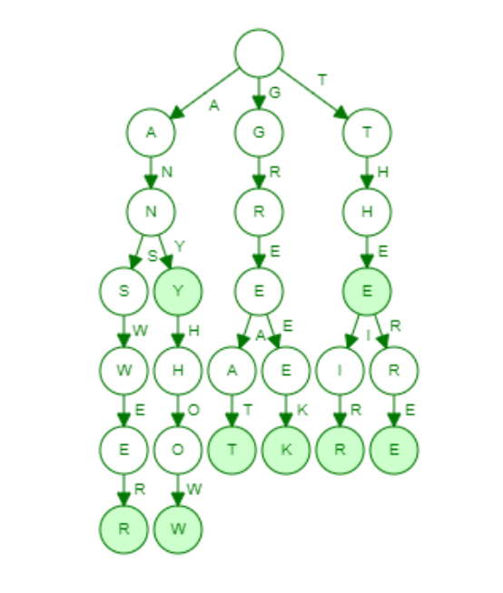

# Ghost-Android-Game

[Ghost](https://en.wikipedia.org/wiki/Ghost_(game)) is a classic word game where players take turns adding letters to a growing word fragment, aiming not to complete a valid word. This Android implementation offers single-player modes, providing an engaging experience for word enthusiasts.

## Features

* **Single-Player Mode**: Challenge an AI opponent powered by a third-order Markov model for intelligent and unpredictable gameplay.

* **Extensive Dictionary**: Utilizes a comprehensive dictionary of over 60,000 words implemented via a Trie data structure for efficient and accurate word validation.

* **User-Friendly Interface**: Enjoy a clean and intuitive interface designed for seamless gameplay.

## Screenshots



*Visualization of the Trie structure used for word validation.*


*Smooth and engaging gameplay experience.*

## How to Play

1. **Game Start**: The game begins with an empty word fragment.

2. **Taking Turns**: Players alternate turns, each adding a single letter to the fragment.

3. **Objective**: Avoid completing a valid word. The player who adds a letter that completes a valid word loses the round.

4. **Challenging**: If a player suspects that the current fragment cannot lead to a valid word, they can challenge their opponent.

5. **Winning the Game**: The first player to force their opponent into completing a word or being unable to continue forms wins the game.

## Technical Details

* **Dictionary Implementation**: The game employs a Trie data structure to store and retrieve over 60,000 words efficiently, ensuring quick lookups during gameplay.

* **AI Opponent**: The single-player mode features an AI opponent that utilizes a third-order Markov model to make intelligent decisions, providing a challenging experience for players.

## Installation

To install and run the game on your Android device:

1. **Clone the Repository**:

   ```bash
   git clone https://github.com/akgarhwal/Ghost-Android-Game.git
   ```


2. **Open in Android Studio**: Import the project into Android Studio.

3. **Build and Run**: Build the project and run it on an emulator or physical device running Android 5.0 (Lollipop) or higher.

---

*Enhance your vocabulary and strategic thinking with the Ghost-Android-Game. Challenge yourself against the AI or compete with friends for endless fun!*
