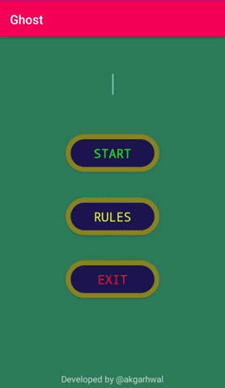

# Ghost-Android-Game

</b>"Ghost is a word game in which players take turns adding letters to a growing word fragment, trying not to be the one to complete a valid word."</b>

System Details :  
Android Studio 2.3.3  
Build : 162.4069837  
JRE : 1.8  

<h2>Screenshot of App :</h2>

<h3>Game Rules: </h3>
<ol>
  <li>Ghost is a word game in which players take turns adding letters to a growing word fragment, trying not to be the one to complete a valid word.</li>
  <li>Each incomplete wordmust be the beginning of an actual word, and  minmum length of a word that counts is 4 letters.</li>
  <li>The player who completes a word lose the round.</li>
  <li>A player is chosen at random to start the game, and begins by naming any letter of the alphabet.</li>
  <li>Players then take turns to add letters to this fragment, with the aim being to avoid completing an actual word.</li>
  <li>The player whose turn it is may :- 
    <ul>
    <li> Instead of adding a letter, challenge the previous player to prove that the current fragment is actually the beginning of a word.</li>
    <li> If the challenged player can name such a word, the challenger loses the round; otherwise the challenged player loses the round.</li>
    <li> If a player bluffs, or completes a word without other players noticing, then play continues.</li>
    </ul>
  </li>     
</ol>

<h2>Ghost Strategy :-</h2>
<h5>A Sample Dictionary :-</h5>

Markov Model from Dictionary :- 
<table>
 <th>Current State</th>
 <th>Next State</th>
 <tr> <td>abc</td>
     <td>def</td>
 </tr>
 <tr> <td>abc</td>
     <td>def</td>
 </tr>
 <tr> <td>abc</td>
     <td>def</td>
 </tr>
 <tr> <td>abc</td>
     <td>def</td>
 </tr>
</table>

<bold>Ghost will use markov model to predict next char of word fragment.</bold>
